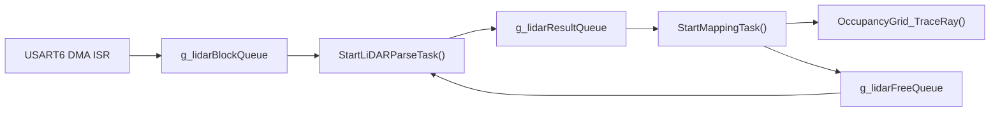

# SLAM Mapping Debug Note

## 1. 背景

本文档记录本项目在接入 LiDAR 建图后，围绕 `M / N / P / G / X` 调试命令进行的一次完整排查过程。

本次排查的目标不是优化建图质量，而是解决以下核心问题：

- 启动 LiDAR 后，系统表现异常
- `scan` 计数会停在很小的数字
- `G` / `X` 会卡住
- 一度看起来像“死机”或“死锁”

最终结论是：

- 问题的根因不在蓝牙本身
- 也不在 LiDAR 启停命令本身
- 真正根因在 occupancy grid 射线更新函数 `OccupancyGrid_TraceRay()` 的 Bresenham 实现错误


## 2. 现象回顾

调试过程中，先后观察到以下现象：

- 早期版本中，发送 `M` 之后蓝牙命令容易失效
- 修掉蓝牙二进制雷达流默认输出后，`M / N` 已经可以正常响应
- 但 `scan` 计数会停在 `4`、`5`、`6` 等很小的数字
- `raw` 会固定在某个值，例如 `398`、`404`、`407`
- `dma_drop` 会持续增长
- `P` 命令通常还能正常返回
- `G` 和 `X` 则会卡住
- 更关键的是：一旦系统进入这个状态，即使发送 `N` 停止 LiDAR，`G` 仍然会继续卡住

这个现象非常重要，因为它说明：

- 不是 LiDAR 还在持续占用蓝牙串口
- 不是 `M / N` 的启停逻辑本身导致系统死机
- 而是“地图相关路径”出了问题


## 3. 调试命令与统计项说明

为了定位问题，系统增加了以下调试命令：

- `P`：输出 RTOS/runtime 统计、scan 质量信息
- `G`：输出 mapping/grid 状态摘要
- `X`：导出 ASCII 地图
- `M`：启动 LiDAR 建图模式
- `N`：停止 LiDAR

`P` 中最关键的字段含义如下：

- `ctrl`：控制任务循环计数。持续增长表示主控制任务仍在运行
- `cmd`：收到的蓝牙命令计数。持续增长表示命令接收仍在工作
- `dma`：成功进入系统处理链路的 DMA block 数
- `dma_drop`：DMA block 队列满后被丢弃的次数
- `scan`：成功完成的整帧 scan 数
- `raw`：最近一帧成功完成 scan 的原始点数
- `usable`：最近一帧中通过质量筛选的点数

这里最容易误解的是 `raw` 和 `scan`：

- `scan` 不是“雷达总共扫到多少圈”，而是“成功走通整个解析链路的 scan 帧数”
- `raw` 不是累计值，而是“最近一帧成功完成的 scan 里有多少个点”

所以当系统卡住时，常见现象会是：

- `scan` 停在 `5` 或 `6`
- `raw` 固定在最后一帧成功值
- `dma_drop` 持续上涨

这并不表示 LiDAR 没数据，而表示：

- DMA 仍在来数据
- 但新数据已经无法继续走通下游处理链路


## 4. 初期假设与排除过程

### 4.1 怀疑蓝牙串口被雷达数据淹没

这是最早的合理猜测。因为旧实现中，`M` 之后会把原始 LiDAR 数据持续发到蓝牙串口。

因此先做了以下处理：

- `M` 默认不再输出二进制 LiDAR 数据
- 增加 `T0/T1` 开关控制二进制输出
- 增加 `P/G/X` 调试接口

这一步解决了“`M` 之后马上没有命令响应”的问题，但没有解决 `scan` 卡住和 `G/X` 卡住的问题。

结论：

- 蓝牙二进制流曾经是问题之一
- 但不是最终根因


### 4.2 怀疑任务优先级和串口发送阻塞

后续又观察到：

- 高频发送 `P`
- 或调用 `X`
- 容易让系统表现得很卡

因此又检查了：

- `defaultTask`
- `lidarParseTask`
- `mappingTask`
- `commTask`

并分析了 `UART5` 在 `9600` 波特率下的同步发送开销。

这一步解释了“为什么系统有时看起来像死机”，但仍解释不了一个更强的现象：

- 即使 `M` 后什么都不发
- 等很久再发一次 `P`
- `scan` 仍会自己停在 `5` 或 `6`

结论：

- 串口输出会放大问题
- 但不是主因


### 4.3 怀疑经典死锁

当 `G` 和 `X` 经常卡住时，很自然会怀疑互斥锁死锁。

但日志同时显示：

- `ctrl` 仍在增长
- `cmd` 仍在增长
- `P` 还能正常返回

这不像经典“所有任务都互相等待”的死锁，更像：

- 某个任务持有了某个关键 mutex
- 其它需要这个 mutex 的命令都被卡住
- 但系统其他部分仍然活着


## 5. 关键突破

真正把问题范围锁死的是下面这个实验：

- 发送 `M`
- 再发送 `N`
- 此时 `P` 仍然可以正常返回
- 但 `G` 会永久卡住

这个实验的意义非常大。

如果 `N` 之后 `G` 仍然卡住，说明：

- 问题不是“LiDAR 仍在工作”
- 问题不是“蓝牙仍在输出大量数据”
- 而是地图相关的共享资源已经处于异常状态

结合代码路径可以知道：

- `P` 不需要拿 `g_gridMutex`
- `G` 需要调用 `MappingTask_GetStatsSnapshot()`
- `X` 需要调用 `MappingTask_RenderAsciiRow()`
- 这两者都需要拿 `g_gridMutex`

因此可以推断：

- `g_gridMutex` 被长期占住
- 占住它的最可能任务是 `mappingTask`


## 6. 代码链路分析

### 6.1 LiDAR 数据处理主链路

数据链路如下：



对应代码位置：

- DMA block 入队：`Core/Src/lidar.c`
- parse task：`Core/Src/freertos.c` 中 `StartLiDARParseTask()`
- mapping task：`Core/Src/mapping_task.c` 中 `StartMappingTask()`
- occupancy grid 射线更新：`Core/Src/occupancy_grid.c`


### 6.2 parse task 为什么会卡在 `scan=5/6`

`StartLiDARParseTask()` 的关键片段如下：

- 一旦一帧 scan 完成，就把结果放进 `g_lidarResultQueue`
- 然后再从 `g_lidarFreeQueue` 取回一个空闲 buffer

对应位置：

- [freertos.c:454] `osMessageQueuePut(g_lidarResultQueue, ..., osWaitForever);`
- [freertos.c:455] `osMessageQueueGet(g_lidarFreeQueue, ..., osWaitForever);`

这两个都是阻塞等待。

因此只要 mapping task 不再归还 buffer，parse task 就会卡在这里。之后：

- DMA 还在继续进数据
- block queue 很快塞满
- `dma_drop` 开始持续上涨
- `scan` 停在最后几帧成功值

这正好解释了为什么调试时 `scan` 会卡在 `5` 或 `6`。


### 6.3 mapping task 为什么会把整个地图路径拖死

`mapping_task_update_grid_from_scan()` 的关键特征是：

- 在一开始就获取 `g_gridMutex`
- 持锁状态下完成整帧 scan 的所有地图更新工作

对应位置：

- 加锁：`Core/Src/mapping_task.c:95`
- 解锁：`Core/Src/mapping_task.c:133`

持锁期间会做：

- 点筛选
- 坐标变换
- `world -> cell`
- `OccupancyGrid_TraceRay()`

只要这中间某一步进入无限循环，结果就是：

- `mappingTask` 永远不释放 `g_gridMutex`
- `G` 永远卡住
- `X` 永远卡住
- parse task 最终因 buffer 无法归还而堵死


## 7. 最终根因

最终确认根因在：

- `Core/Src/occupancy_grid.c`
- 函数：`OccupancyGrid_TraceRay()`

这段代码原本意图实现 Bresenham line traversal，但写法存在一个关键错误：

- 第二个方向判断使用了已经被第一个判断修改过的 `err`

错误写法的核心逻辑类似：

```c
if ((2 * err) >= dy) {
    err += dy;
    x0 += sx;
}
if ((2 * err) <= dx) {
    err += dx;
    y0 += sy;
}
```

问题在于：

- 第二个 `if` 使用的不是“本轮开始时的误差值”
- 而是“已经被第一个 `if` 更新过的误差值”

这会导致某些斜率下，射线偏离终点并且再也回不到终点，`for (;;)` 会永久运行下去。


## 8. 为什么 Bresenham 会出错

### 8.1 正确思想

标准 Bresenham 的关键是：

- 每一轮先保存一次 `e2 = 2 * err`
- 后续两个方向判断都基于同一个 `e2`

这是因为：

- 本轮是否应该在 `x` 方向移动
- 本轮是否应该在 `y` 方向移动

都必须基于“同一个旧误差状态”来决定。


### 8.2 错误后果

如果先改了 `err`，再用修改后的 `err` 判断另一个方向，那么路径就不再是标准 Bresenham 轨迹。

轻则：

- 线段不准确

重则：

- 坐标持续偏离终点
- 进入无限循环


### 8.3 一个典型错误例子

例如从 `(0,0)` 走到 `(2,1)`。

错误写法可能走成：

- `(0,0)`
- `(1,1)`
- `(2,2)`
- `(3,2)`
- `(4,2)`
- ...

于是永远无法满足 `(x0 == x1 && y0 == y1)`，循环不结束。


## 9. 修复内容

本次最终修复做了两件事：

### 9.1 改成标准 Bresenham 写法

在每轮迭代开始时：

- 先计算 `e2 = 2 * err`
- 两个方向判断都基于同一个 `e2`

这样才能保证射线正确地向终点收敛。


### 9.2 增加步数保护

除了算法修正外，还加入了 `remaining_steps` 保护：

- 上限取 `dx + |dy| + 1`

这样即使未来又出现异常输入或其他逻辑问题，也不会再把 `mappingTask` 永久卡在持锁区。

这一步属于防御式编程，不是主要修复，但很有必要。


## 10. 修复后为什么问题消失

修复后，`TraceRay()` 能正常返回，因此：

- `mappingTask` 能正常离开持锁区
- `g_gridMutex` 能被释放
- `G` 和 `X` 不再永久卡住
- scan buffer 能重新归还给 parse task
- `scan` 计数可以继续增长
- `dma_drop` 不再因为整条链路堵死而异常堆积


## 11. 这次排查中积累的调试经验

### 11.1 如何区分“死机”和“局部阻塞”

如果看到：

- `P` 还能正常返回
- `ctrl` 还在增长
- `cmd` 还在增长

就不要轻易下结论说“系统死机”。

更准确的说法通常是：

- 某条任务链路被堵住了
- 某个 mutex 被长期占住了
- 只有依赖这条链路的功能失效


### 11.2 如何解读 `scan` 卡住而 `dma_drop` 增长

这组现象几乎总是说明：

- 上游中断还在产生数据
- 下游消费者已经无法及时消化
- 队列或 buffer 被打满

也就是说：

- 问题不在“有没有数据”
- 而在“数据链路能不能闭环流动”


### 11.3 为什么调试命令很重要

这次能够从“感觉像死机”收敛到“grid mutex 被卡住”，关键依赖于以下调试观测：

- `P` 提供 RTOS/runtime 状态
- `G` 用来验证 grid 访问是否被卡
- `X` 用来验证地图渲染路径是否被卡
- `M/N` 用来区分“LiDAR 活跃状态问题”还是“地图状态已损坏”

如果没有这些观测点，很容易一直在错误方向上猜测蓝牙、波特率或 FreeRTOS 调度。


## 12. 与本项目代码结构相关的知识点

### 12.1 Producer-Consumer 管线

本项目 LiDAR 处理使用的是典型的 producer-consumer 模型：

- producer：DMA ISR
- consumer 1：parse task
- consumer 2：mapping task

这类系统的关键不是“单个模块能不能跑”，而是：

- 每一环是否会阻塞下一环
- buffer 是否能被及时归还


### 12.2 互斥锁的危险区

如果一个任务在持有 mutex 时做大量计算，或者调用可能无限循环的函数，就会导致：

- 其它所有依赖该 mutex 的路径一起被拖死

所以经验上应尽量：

- 缩短持锁区
- 避免在持锁区做高代价运算
- 对复杂循环加入上界保护


### 12.3 防御式编程

像 `TraceRay()` 这种理论上应该一定结束的函数，实际工程里仍建议加保护：

- 最大步数限制
- 输入边界检查
- 必要时加超时或 debug counter

这类保护能大幅降低“单点 bug 放大成整条系统卡死”的风险。


## 13. 后续建议

虽然这次核心 bug 已经修掉，但后续仍建议继续优化以下点：

- 进一步缩短 `mapping_task_update_grid_from_scan()` 的持锁时间
- 在 `P` 中增加 queue occupancy 统计，便于直接判断堵点在 `resultQueue` 还是 `freeQueue`
- 让 `X` 导图与实时建图解耦，避免大块串口输出影响交互体验
- 如果后续接 ICP，再把 scan matching 的耗时纳入 runtime stats


## 14. 一句话结论

本次问题的本质不是“蓝牙坏了”或“系统死机”，而是：

**错误的 Bresenham 射线更新导致 `mappingTask` 在持有 `g_gridMutex` 时进入无限循环，进而堵死了整个 SLAM 建图数据链路。**
